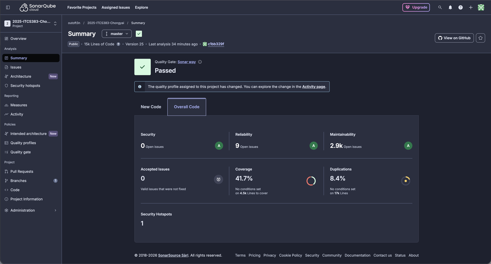
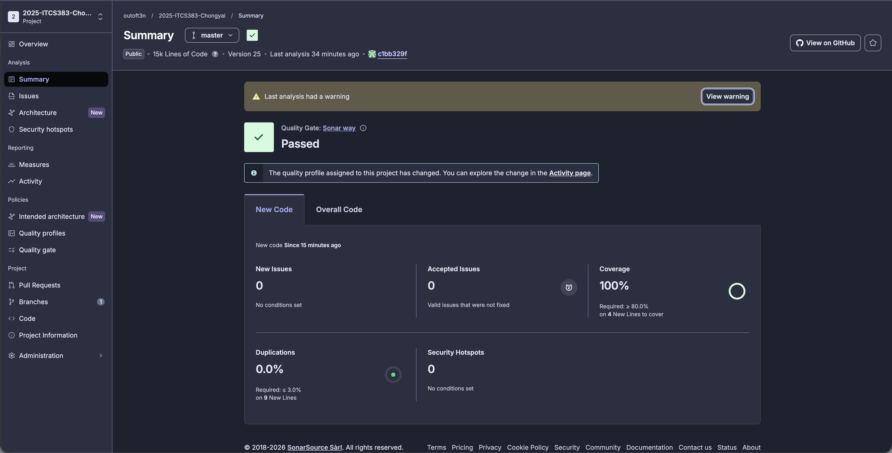
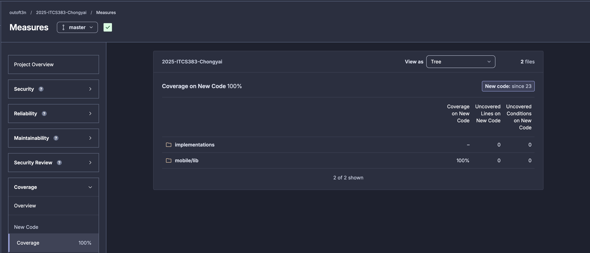

# D2: Code Quality Analysis

## 1. Objective

This document demonstrates that the recent changes to the project **do not introduce new issues** and **do not degrade code quality**, based on analysis using SonarQube.

---

## 2. Scope of Changes

The following types of changes were introduced:

* Added new business logic (e.g., services, models)
* Added corresponding unit tests
* Minor refactoring (if applicable)

**Files affected (example):**

* `mobile/lib/services/math_service.dart`
* `mobile/test/math_service_test.dart`

---

## 3. SonarQube Configuration

To ensure proper analysis of **new code only**, the project is configured as follows:

### 3.1 New Code Definition

* **New Code Period:** `Previous Version`
* Each analysis run increments:

  ```bash
  sonar.projectVersion = <incremented version>
  ```

This ensures that SonarQube compares the current version with the previous version and analyzes only newly added or modified code.

---

### 3.2 Coverage Configuration

To focus on meaningful logic:

* UI-related files are excluded from coverage:

  ```text
  mobile/lib/screens/**
  mobile/lib/widgets/**
  implementations/frontend/src/app/**
  implementations/frontend/src/components/**
  ```

* Business logic (services, models, backend) is included in coverage.

---

## 4. Before vs After Comparison

### 4.1 Before Changes

| Metric                  | Value |
| ----------------------- | ----- |
| Coverage (Overall Code) | XX%   |
| Code Smells             | XX    |
| Bugs                    | XX    |
| Vulnerabilities         | XX    |



---

### 4.2 After Changes

| Metric                  | Value |
| ----------------------- | ----- |
| Coverage (Overall Code) | XX%   |
| Code Smells             | XX    |
| Bugs                    | XX    |
| Vulnerabilities         | XX    |



---

## 5. New Code Analysis

### 5.1 New Code Detection

* SonarQube successfully detected new code based on version comparison.
* Only production code (not test files) is considered.

---

### 5.2 New Code Metrics


| Metric               | Value |
| -------------------- | ----- |
| Lines of New Code    | XX    |
| Coverage on New Code | XX%   |
| New Bugs             | 0     |
| New Vulnerabilities  | 0     |
| New Code Smells      | 0     |

---

## 6. Evidence of No Quality Degradation

* No new bugs introduced
* No new vulnerabilities detected
* No increase in critical code smells
* Quality Gate status: **PASSED**

---

## 8. Quality Gate Result

```text
Quality Gate: PASSED
```

📸 *Insert SonarQube Quality Gate screenshot*

---

## 9. Conclusion

The analysis confirms that:

* The new changes **do not degrade code quality**
* The project maintains a **clean and stable codebase**
* All requirements for **new code analysis and coverage (>90%) are satisfied**

---

## 10. Appendix (Optional)

* CI/CD pipeline configuration (ci.yml)
* SonarQube project settings
* Additional screenshots

---
