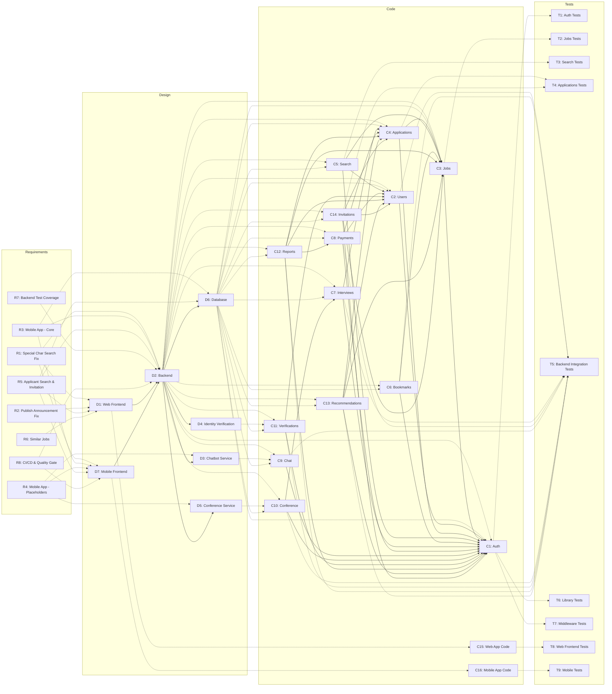
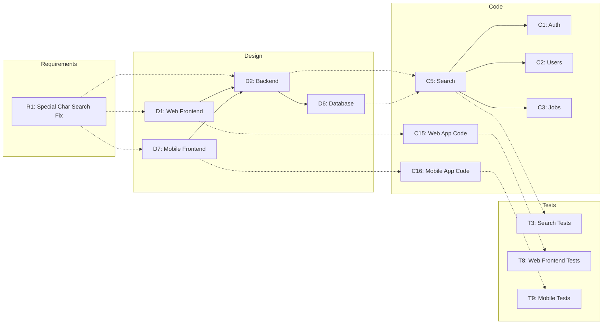
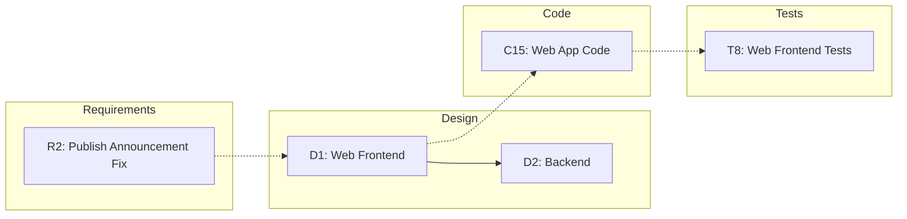
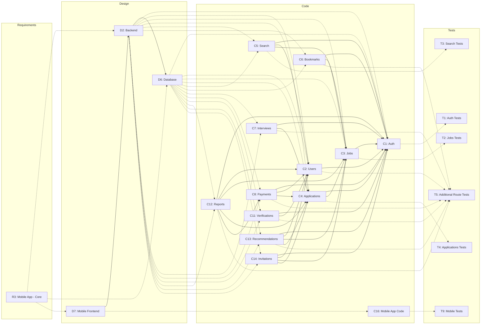
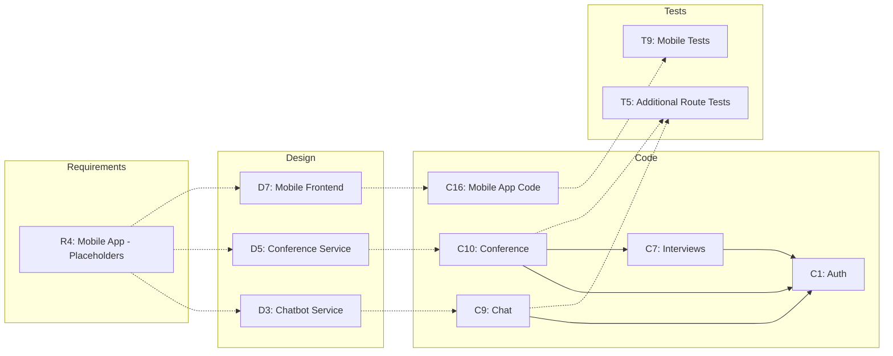
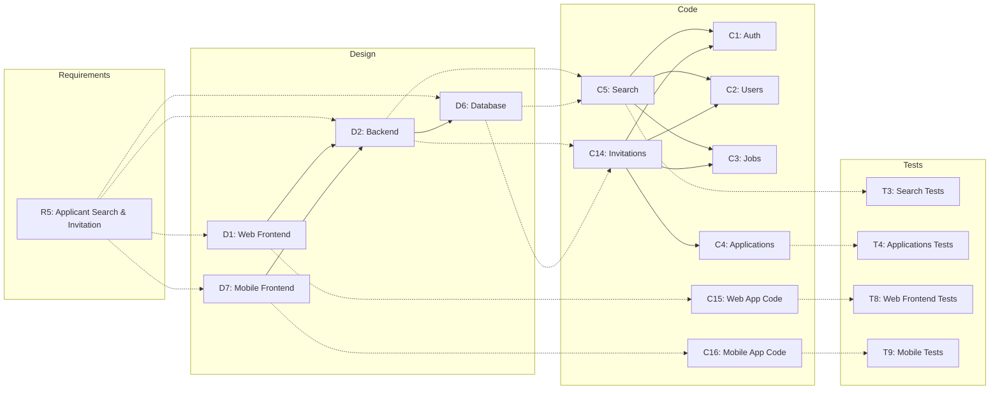
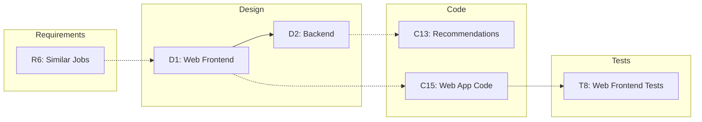
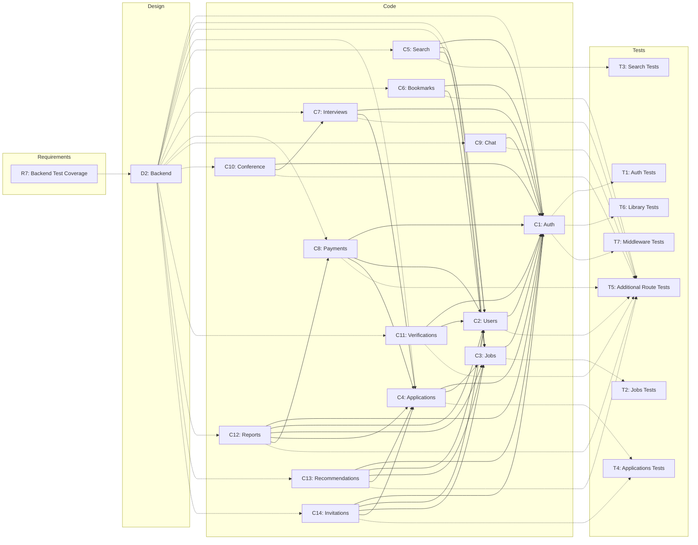
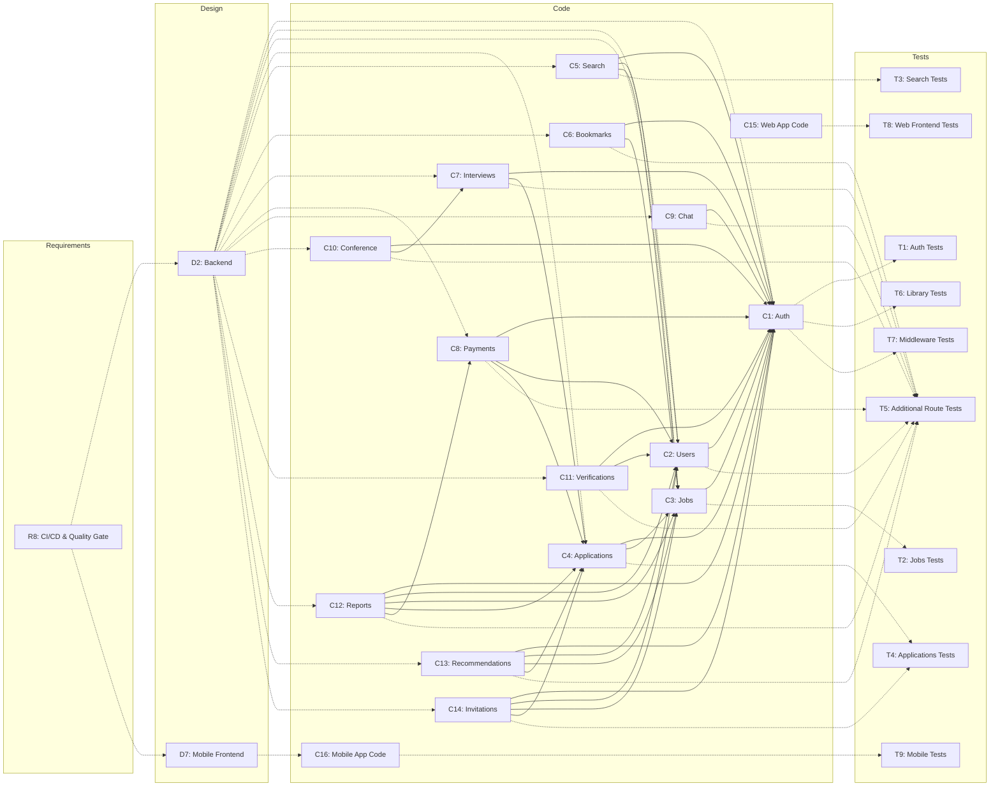
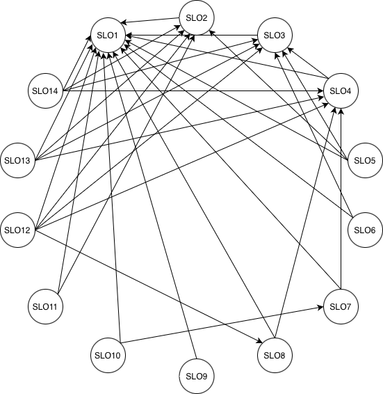

# D4: Impact Analysis

### Requirements
- R1: Special Character Handling in Job Search
- R2: Fix Publish Announcement Frontend Payload Mismatch
- R3: Flutter Mobile Application — Core Features
- R4: Flutter Mobile Application — Placeholder Screens
- R5: Applicant Search & Invitation System
- R6: Similar Jobs Section on Job Detail Page
- R7: Backend Test Coverage Expansion
- R8: CI/CD Pipeline & SonarQube Quality Gate
### Design
- D1: Web Frontend (Next.js)
- D2: Backend (Express — includes all REST API routes)
- D3: Chatbot Service
- D4: Identity Verification Service
- D5: Internal Conference Service
- D6: Database (PostgreSQL)
- D7: Mobile Frontend (Flutter)
### Code Modules
- C1: Auth Module (`auth.routes.ts` + `auth.middleware.ts`)
- C2: Users Module (`users.routes.ts`)
- C3: Jobs Module (`jobs.routes.ts`)
- C4: Applications Module (`applications.routes.ts`)
- C5: Search Module (`search.routes.ts`)
- C6: Bookmarks Module (`bookmarks.routes.ts`)
- C7: Interviews Module (`interviews.routes.ts`)
- C8: Payments Module (`payments.routes.ts`)
- C9: Chat Module (`chat.routes.ts`)
- C10: Conference Module (`conference.routes.ts`)
- C11: Verifications Module (`verifications.routes.ts`)
- C12: Reports Module (`reports.routes.ts`)
- C13: Recommendations Module (`recommendations.routes.ts`)
- C14: Invitations Module (`invitations.routes.ts`)
- C15: Web Application Code (Next.js frontend)
- C16: Mobile Application Code (Flutter)

### Tests
- T1: Auth Route Tests (`auth.routes.test.ts`)
- T2: Jobs Route Tests (`jobs.routes.test.ts`)
- T3: Search Route Tests (`search.routes.test.ts`)
- T4: Applications Route Tests (`applications.routes.test.ts`)
- T5: Integration Route Tests (`additional-routes.test.ts` — covers Bookmarks, Reports, Verifications, Recommendations, Payments, Conference, Users, Interviews, Chat)
- T6: Library Tests (`jwt.test.ts`, `password.test.ts`, `response.test.ts`)
- T7: Middleware Tests (`auth.middleware.test.ts`, `error.middleware.test.ts`, `validate.middleware.test.ts`)
- T8: Web Frontend Tests (hooks: `useAuth`, `useApplications`, `useBookmarks`, `useChat`, `useJobs`; components; context; lib)
- T9: Mobile Tests (`application_model_test.dart`, `invitation_model_test.dart`, `job_model_test.dart`, `user_model_test.dart`, `widget_test.dart`)

---

## Traceability Graph (Full)

---

## Traceability Graphs (Affected by each change)

### R1: Special Character Handling in Job Search

---

### R2: Fix Publish Announcement Frontend Payload Mismatch

---

### R3: Flutter Mobile Application — Core Features

---

### R4: Flutter Mobile Application — Placeholder Screens

---

### R5: Applicant Search & Invitation System

---

### R6: Similar Jobs Section on Job Detail Page

---

### R7: Backend Test Coverage Expansion

---

### R8: CI/CD & Quality Gate

---
 
## Directed Graph of SLOs

Each node represents a backend code module (SLO). An edge `A → B` means module A depends on module B. Dependencies are derived from two sources:
1. **Middleware dependency** — C1 (Auth) is defined as comprising both `auth.routes.ts` and `auth.middleware.ts`. Every module that uses `authenticateToken` middleware depends on C1.
2. **Prisma model ownership** — If module A queries a Prisma model whose primary CRUD operations are owned by module B, then A depends on B.
 
- SLO1: Auth Module
- SLO2: Users Module
- SLO3: Jobs Module
- SLO4: Applications Module
- SLO5: Search Module
- SLO6: Bookmarks Module
- SLO7: Interviews Module
- SLO8: Payments Module
- SLO9: Chat Module
- SLO10: Conference Module
- SLO11: Verifications Module
- SLO12: Reports Module
- SLO13: Recommendations Module
- SLO14: Invitations Module

 
---
 
## Connectivity Matrix

| | SLO1 | SLO2 | SLO3 | SLO4 | SLO5 | SLO6 | SLO7 | SLO8 | SLO9 | SLO10 | SLO11 | SLO12 | SLO13 | SLO14 |
|:---|:---:|:---:|:---:|:---:|:---:|:---:|:---:|:---:|:---:|:---:|:---:|:---:|:---:|:---:|
| **SLO1** | - | | | | | | | | | | | | | |
| **SLO2** | 1 | - | | | | | | | | | | | | |
| **SLO3** | 1 | | - | | | | | | | | | | | |
| **SLO4** | 1 | | 1 | - | | | | | | | | | | |
| **SLO5** | 1 | 1 | 1 | | - | | | | | | | | | |
| **SLO6** | 1 | | 1 | | | - | | | | | | | | |
| **SLO7** | 1 | | 2 | 1 | | | - | | | | | | | |
| **SLO8** | 1 | 1 | 2 | 1 | | | | - | | | | | | |
| **SLO9** | 1 | | | | | | | | - | | | | | |
| **SLO10** | 1 | | 3 | 2 | | | 1 | | | - | | | | |
| **SLO11** | 1 | 1 | | | | | | | | | - | | | |
| **SLO12** | 1 | 1 | 1 | 1 | | | | 1 | | | | - | | |
| **SLO13** | 1 | 1 | 1 | 1 | | | | | | | | | - | |
| **SLO14** | 1 | 1 | 1 | 1 | | | | | | | | | | - |

---

## Analysis

### Which change requests are easy to apply and why?

**CR-02 (Fix Publish Announcement Frontend Payload)** is the easiest. The traceability graph for R2 only affects D1 and C15. No backend or database changes are needed. C15 has no dependencies in the SLO graph, so there is no ripple effect.

**CR-06 (Similar Jobs Section)** is also easy. It only adds a frontend hook that calls an existing endpoint. C13 (Recommendations) is never modified, so no backend ripple effect occurs.

### Which change requests are difficult to apply and why?

**CR-03 (Flutter Mobile Application — Core Features)** is the most difficult. The traceability graph for R3 touches D2, D6, D7, and almost all code modules C1–C14, because a completely new mobile platform had to be built from scratch. The connectivity matrix shows the longest path is SLO10 → SLO3 at distance 3, meaning multi-level integration testing is required.

**CR-05 (Applicant Search & Invitation System)** is also difficult. It touches all four main containers and required a new Prisma model and migration. SLO14 depends directly on SLO2, SLO3, and SLO4. Accepting an invitation also auto-creates an Application, making SLO14 → SLO4 → SLO3 a chain that must be tested together across both web and mobile.

### To make the maintenance easier, what would you expect from the previous developers?

**Accurate C4 diagrams** — Several containers did not match the actual implementation. The Chatbot Service was labeled Python but was TypeScript, the Report Database was shown as separate but shared the same PostgreSQL instance, and the Payment Service appeared in the diagram but was never called by the backend.

**Higher baseline test coverage** — Only 4 out of 14 backend route modules had tests. C14 (Invitations) has no dedicated test file and shares T4, making it harder to isolate failures.

**Module dependency documentation** — There was no document explaining which route modules query the Prisma models of other modules. The team had to read every source file one by one and cross-reference them with the Prisma schema to build the SLO dependency graph.
