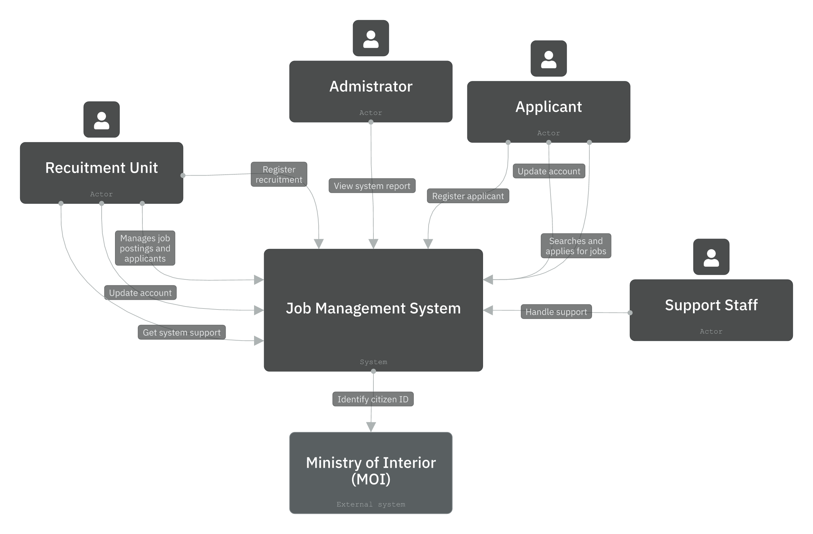

# 1. Project Features: Job Center Management System

**Project:** Job Center Management System

---

## 1. Project Overview

The Job Center Management System is a web-based platform that connects job applicants with recruitment units. It supports the full recruitment lifecycle from applicant registration and job search through to interview scheduling and applicant review. The system integrates with the Ministry of Interior (MOI) for citizen identity verification and provides a support channel via chatbot with human escalation.

---

## 2. Actors

| Actor | Type | Description |
|---|---|---|
| Applicant | User | Job seeker who registers, searches for jobs, bookmarks, and applies |
| Recruitment Unit | User | Organisation that posts job announcements and manages applicants |
| Administrator | User | System operator who monitors overall system activity |
| Support Staff | User | Handles human support requests escalated from the chatbot |
| Ministry of Interior (MOI) | External system | Verifies citizen ID during registration |
| Banking System | External system | Handles payment processing |

---

## 3. Feature Summary Table

| Feature | Applicant | Recruitment Unit | Administrator | Support Staff | Status |
|---|---|---|---|---|---|
| Register + Verify citizen ID + Fill profile | ✅ | ✅ | — | — | Implemented |
| Update account | ✅ | ✅ | — | — | Implemented |
| Search job | ✅ | — | — | — | Implemented |
| Bookmark job | ✅ | — | — | — | Implemented |
| View recommended job | ✅ | — | — | — | Implemented |
| Apply for job | ✅ | — | — | — | Implemented |
| Fill announcement detail | — | ✅ | — | — | Implemented |
| Publish announcement | — | ✅ | — | — | ⚠️ Frontend bug |
| Review applicant | — | ✅ | — | — | Implemented |
| Schedule interview + Verify citizen ID | — | ✅ | — | — | Implemented |
| View access count | — | ✅ | — | — | Implemented |
| Get system support + Chatbot + Human escalation | — | ✅ | — | ✅ | Implemented |
| View system report | — | — | ✅ | — | Implemented |
| Delete account | ✅ | ✅ | — | — | ❌ Not implemented |
| Suspend account | ✅ | — | — | — | ❌ Not implemented |
| Select schedule interview | ✅ | — | — | — | ❌ Not implemented |
| Make payment / Banking System | ✅ | — | — | — | ❌ Not implemented |

---

# 2.Verification Results: Design vs. Actual Implementation

## 1. Scope

This document compares all original software design artifacts against the actual implemented system. Discrepancies are classified as:

- **Consistent** — design and implementation match
- **Partially consistent** — exists in both but label/scope is inaccurate
- **Missing in implementation** — feature exists in design but was not implemented
- **Partially implemented** — feature exists but has a known defect
- **Missing in design** — feature exists in implementation but was not captured in the original design
- **Inconsistent** — design contradicts implementation

---

## 2. Use Case Diagram Verification

### 2.1 Applicant — Use Cases

| Use Case | In Design | In Implementation | Status | Notes |
|---|---|---|---|---|
| Register applicant | ✅ | ✅ | Consistent | Includes `<<include>>` Verify citizen ID and Fill profile |
| Verify citizen ID | ✅ | ✅ | Consistent | Triggered via Register applicant |
| Fill profile | ✅ | ✅ | Consistent | Included in registration flow |
| Update account | ✅ | ✅ | Consistent | |
| Search job | ✅ | ✅ | Consistent | |
| Bookmark job | ✅ | ✅ | Consistent | |
| View recommended job | ✅ | ✅ | Consistent | |
| Apply for job | ✅ | ✅ | Consistent | |
| **Delete account** | ✅ | ❌ | **Missing in implementation** | Designed but not implemented |
| **Suspend account** | ✅ | ❌ | **Missing in implementation** | Designed but not implemented |
| **Select schedule interview** | ✅ | ❌ | **Missing in implementation** | Designed but not implemented |
| **Make payment** | ✅ | ❌ | **Missing in implementation** | Designed with Banking System integration, but not implemented |

### 2.2 Recruitment Unit — Use Cases

| Use Case | In Design | In Implementation | Status | Notes |
|---|---|---|---|---|
| Register recruitment | ✅ | ✅ | Consistent | Includes `<<include>>` Verify citizen ID and Fill profile |
| Fill announcement detail | ✅ | ✅ | Consistent | |
| Review applicant | ✅ | ✅ | Consistent | |
| View access count | ✅ | ✅ | Consistent | |
| Schedule interview | ✅ | ✅ | Consistent | |
| Update account | ✅ | ✅ | Consistent | |
| Get system support | ✅ | ✅ | Consistent | Includes `<<include>>` Chat with chatbot; extendable to Contact human support |
| **Publish announcement** | ✅ | ⚠️ | **Partially implemented** | API works correctly (verified via Postman). Frontend fails due to data format mismatch with database schema — payload sent does not match expected DB format |
| **Delete account** | ✅ | ❌ | **Missing in implementation** | Designed but not implemented |

### 2.3 Administrator — Use Cases

| Use Case | In Design | In Implementation | Status | Notes |
|---|---|---|---|---|
| View system report | ✅ | ✅ | Consistent | |

### 2.4 Support Staff — Use Cases

| Use Case | In Design | In Implementation | Status | Notes |
|---|---|---|---|---|
| Contact human support | ✅ | ✅ | Consistent | Extended from Chat with chatbot via `<<extend>>` |

---

## 3. C4 Level 1 Context Diagram Verification

### 3.1 Actors

| Actor | In Original C4 | In Updated C4 | In Implementation | Status |
|---|---|---|---|---|
| Administrator | ✅ | ✅ | ✅ | Consistent |
| Applicant | ✅ | ✅ | ✅ | Consistent |
| Recruitment Unit | ✅ | ✅ | ✅ | Consistent |
| **Support Staff** | ❌ | ✅ | ✅ | **Missing in original C4** — added in updated diagram |

### 3.2 External Systems

| External System | In Original C4 | In Updated C4 | In Implementation | Status |
|---|---|---|---|---|
| Ministry of Interior (MOI) | ✅ | ✅ | ✅ | Consistent — used for citizen ID verification |
| **Banking System** | ✅ | ❌ | ❌ | **Removed from updated C4** — payment not implemented; integration does not exist in actual system |

### 3.3 Relationships

| Relationship | In Original C4 | In Updated C4 | In Implementation | Status |
|---|---|---|---|---|
| Administrator → System (inspect, report) | ✅ | ✅ corrected to: view system report | ✅ | Label corrected — "inspect" does not correspond to any implemented use case |
| Recruitment Unit → System (sends data to) | ✅ | ✅ expanded to specific labels | ✅ | Updated C4 uses more descriptive labels |
| Applicant → System (sends data to) | ✅ | ✅ expanded to specific labels | ✅ | Updated C4 uses more descriptive labels |
| Support Staff → System (handle support) | ❌ | ✅ | ✅ | Added in updated diagram |
| System → MOI (identify citizen ID) | ✅ | ✅ | ✅ | Consistent |
| System → Banking System (proceed payment) | ✅ | ❌ | ❌ | Removed — payment not implemented |

### 3.4 Changes Made to Updated C4 Level 1

1. **Added** Support Staff as an actor with "handle support" relationship to the system
2. **Removed** Banking System external system because payment integration is not implemented
3. **Corrected** Administrator relationship label from "inspect, report" to "view system report"
4. **Expanded** Recruitment Unit relationships into two descriptive labels: "manages job postings and applicants" and "manages account and monitors system"
5. **Expanded** Applicant relationship label to "searches and applies for jobs" and added "register applicant" and "update account" relationships



---

## 4. DFD (Context Level) Verification

### 4.1 External Entities

| Entity | In DFD | In Implementation | Status | Notes |
|---|---|---|---|---|
| Applicant | ✅ | ✅ | Consistent | |
| Recruitment Unit | ✅ | ✅ | Consistent | |
| Administrator | ✅ | ✅ | Consistent | |
| Ministry of Interior | ✅ | ✅ | Consistent | |
| **Banking System** | ✅ | ❌ | **Inconsistent** | Payment is not implemented; Banking System integration does not exist in the actual system |
| **Support Staff** | ❌ | ✅ | **Missing in DFD** | Support Staff is an actor in the actual system — handles human support escalated from chatbot; not shown in DFD at all |

### 4.2 Data Flows

| Data Flow | In DFD | In Implementation | Status | Notes |
|---|---|---|---|---|
| Applicant → System: `Register / Search / Apply` | ✅ | ✅ | Partially consistent | Label is too narrow — actual flows also include Update account, Bookmark job, View recommended job |
| Recruitment Unit → System: `Post Jobs / Review Applicants` | ✅ | ✅ | Partially consistent | Actual flows also include Schedule interview, Update account, Get system support, View access count |
| Administrator → System: `View Reports / Manage System` | ✅ | ✅ | Partially consistent | "Manage System" is misleading — Administrator in actual implementation only has View system report; no configuration or management actions are implemented |
| System → MOI: `Verify Citizen ID` | ✅ | ✅ | Consistent | Triggered during both Applicant and Recruitment Unit registration flows |
| System → Banking System: `Process Payment` | ✅ | ❌ | **Inconsistent** | Payment processing is not implemented in the actual system |
| **System ↔ Support Staff: `Handle support request`** | ❌ | ✅ | **Missing in DFD** | Chatbot can escalate to human Support Staff via `<<extend>>`; this data flow is absent from DFD |

---

## 5. Overall Summary of Discrepancies

### 5.1 Features in Design but Not Implemented

| # | Actor | Feature | Affected Diagrams |
|---|---|---|---|
| 1 | Applicant | Delete account | Use Case |
| 2 | Applicant | Suspend account | Use Case |
| 3 | Applicant | Select schedule interview | Use Case |
| 4 | Applicant | Make payment / Banking System | Use Case, C4, DFD |
| 5 | Recruitment Unit | Delete account | Use Case |

### 5.2 Features Partially Implemented (Defects)

| # | Actor | Feature | Defect | Affected Diagrams | Recommendation |
|---|---|---|---|---|---|
| 1 | Recruitment Unit | Publish announcement | Frontend sends payload in incorrect format — does not match database schema. API works correctly via Postman. | Use Case | Fix frontend payload serialization to match API contract |

### 5.3 Design Gaps (In Implementation but Missing from Original Design)

| # | Artifact | Gap | Resolution |
|---|---|---|---|
| 1 | C4 Level 1 (original) | Support Staff actor missing | Added in updated C4 diagram |
| 2 | C4 Level 1 (original) | Administrator label inaccurate ("inspect") | Corrected to "view system report" in updated diagram |
| 3 | C4 Level 1 (original) | Banking System shown as active | Removed from updated C4 |
| 4 | DFD | Support Staff entity and flow missing | Add Support Staff with handle support flow |
| 5 | DFD | Banking System flow does not reflect reality | Remove Process Payment flow and Banking System entity |
| 6 | DFD | Data flow labels too narrow for Applicant and Recruitment Unit | Broaden labels to reflect all implemented interactions |
| 7 | DFD | No data stores present | Add at minimum: Job listings, User accounts, Applications |
| 8 | DFD | No bidirectional flows shown | Add return flows from system back to actors and external systems |

---

## 6. Conclusion

The implemented system covers the majority of the designed use cases. Key gaps across all three diagrams are:

- **Payment and Banking System** — designed across all diagrams but not implemented
- **Account management features** (delete/suspend) for Applicant and Recruitment Unit — designed but not built
- **Support Staff** — implemented but missing from both the original C4 and the DFD
- **Publish Announcement** — has a known frontend bug (API layer is functional)

---

# 3.Report the reflections on receiving the handover project.
## 3A.Technology Stack

### 1. Frontend

| Technology | Version/Type | Purpose |
|---|---|---|
| Next.js | React framework | Core framework for building the user interface with server-side rendering and routing |
| React.js | UI library | Component-based UI development |
| Tailwind CSS | CSS utility framework | Styling and responsive layout |
| React Hook Form | Form library | Form state management and validation handling |
| Axios | HTTP client | API communication between frontend and backend |
| Zod | Schema validation | Client-side schema to validate form input and ensure the data structure is correct before sending it to the backend |

---

### 2. Backend

| Technology | Version/Type | Purpose |
|---|---|---|
| Node.js | Runtime | JavaScript runtime environment for server-side execution |
| Express.js | Web framework | Building RESTful API endpoints and handle the main business logic of the system |
| TypeScript | Language | Type-safe development across the backend codebase |
| JWT (JSON Web Token) | Authentication | Stateless authentication and authorization, allowing the system to verify logged-in users securely. |
| bcryptjs | Cryptography | Secure password hashing before storing in the database |
| Zod | Schema validation | Server-side request body and parameter validation to validate incoming request data before processing |

---

### 3. Database

| Technology | Version/Type | Purpose |
|---|---|---|
| Prisma ORM | ORM | Database schema management, migrations, and type-safe queries |
| PostgreSQL | Relational database | Primary data store for all system data |

---

### 4. Other Tools and Technologies

| Technology | Version/Type | Purpose |
|---|---|---|
| Docker | Containerisation | Standardizing the development environment and make project setup easier across different machines |
| Jest | Testing framework | Unit and integration testing |
| ESLint | Linter | Checking code quality and maintain a consistent coding style |
| dotenv | Configuration | Environment variable management across environments |

## 3B.Required information to successfully hand over the project

To ensure a smooth handover, the receiving team essentially needs:

### 1. Project Overview
- Clear business logic
- Core features
- User roles

### 2. Tech Stack & Prerequisites
- Required software versions:
  - Node.js 18
  - Docker
  - PostgreSQL

### 3. Setup Instructions
Step-by-step guide:
``` bash
# Install dependencies
npm install

# Configure environment variables
cp .env.example .env

# Run the server
npm run dev
```
### 4. Test Data
- Database migration commands
- Seeding scripts
- Demo accounts for testing

### 5. Architecture & APIs
- System design diagrams (e.g., C4 model)
- API documentation
- Explanation of service communication

## 3C. SonarQube Code Quality Analysis

### SonarQube Overview


The SonarQube analysis provides an overview of the overall code quality of the Chongyai-JC system. Based on the latest scan, the project **successfully passed the SonarQube Quality Gate**, indicating that the code meets the predefined quality standards.

The system shows **strong security and reliability**, with no vulnerabilities and only a small number of reliability issues. However, a relatively high number of maintainability issues were detected. These issues are mostly repetitive and can be grouped into several common patterns.

Overall, the project is in **good condition**, but requires refactoring efforts to improve maintainability and reduce technical debt.

---

### Quality Metrics Summary

The main quality metrics reported by SonarQube are summarized below.

| Metric                 | Result |
| ---------------------- | ------ |
| Quality Gate           | Passed |
| Security Issues        | 0      |
| Reliability Issues     | 2      |
| Maintainability Issues | 73     |
| Test Coverage          | 50.9%  |
| Code Duplication       | 1.9%   |
| Security Hotspots      | 0      |

---

#### Security

The analysis reported **0 security vulnerabilities**, resulting in a **Security Rating of A**. No immediate security risks were identified.

---

#### Reliability


SonarQube detected **2 reliability issues**, both related to minor code patterns that can be improved. These issues do not significantly affect system behavior.

---

#### Maintainability


The system contains **73 maintainability issues**, mostly categorized as **code smells**.

From the analysis of all issues , they can be grouped into the following major categories:

---

#### 1. Repeated Type Handling & Query Parsing Issues

**Problem:**
Improper handling of query parameters without explicit type conversion.

**Impact:**

* Potential runtime bugs
* Poor type safety
* Repeated logic across many routes

**Improvement:**

* Centralize query parsing logic
* Use proper type casting (e.g., Number(req.query.page))
* Create utility/helper function

---

#### 2. React Props Immutability Issues

* Pattern: Mark the props of the component as read-only

**Problem:**
Props are not explicitly marked as immutable.

**Impact:**

* Violates React best practices
* Reduces code safety and predictability

**Improvement:**

* Use `readonly` in TypeScript props
* Enforce immutability for component inputs

---

#### 3. Code Cleanliness Issues

* Unused imports (e.g., `User`, `Bell`, `Trash2`)
* Unnecessary assertions
* Redundant code

**Problem:**
Dead or unused code increases clutter.

**Impact:**

* Reduced readability
* Harder maintenance

**Improvement:**

* Remove unused imports
* Enable ESLint rules (`no-unused-vars`)

---

#### 4. Readability & Refactoring Issues

* Nested ternary operations
* Replaceable patterns (e.g., optional chaining)

**Problem:**
Complex or outdated syntax reduces readability.

**Impact:**

* Harder to understand logic
* Increased cognitive load

**Improvement:**

* Refactor into clear conditional statements
* Use modern JavaScript features

---

#### 5. Platform & Best Practice Issues

* Prefer `globalThis` over `window`
* Accessibility issues (`<dialog>`, `<output>`)
* React key using array index

**Problem:**
Code does not follow modern platform standards.

**Impact:**

* Reduced portability
* Accessibility concerns
* Potential UI bugs

**Improvement:**

* Follow modern JS standards
* Improve accessibility compliance
* Use stable keys in React

---

#### 6. Async Pattern Issue

* Prefer top-level await over promise chain

**Problem:**
Outdated async handling pattern.

**Impact:**

* Less readable asynchronous code

**Improvement:**

* Use `await` for cleaner async flow

---

### Test Coverage

The project has **50.9% test coverage**, which is considered moderate.

This coverage is primarily derived from backend tests, meaning that the frontend components are largely not covered by automated testing.

Improving test coverage would provide a stronger safety net for future changes.

---

### Code Duplication

The analysis reports **1.9% duplication**, which is relatively low.

This indicates that the codebase avoids redundancy and is generally well-structured.

---

### Security Hotspots

No security hotspots were detected, indicating that there are no areas requiring manual security review.

---

### Discussion

The SonarQube analysis indicates that the Chongyai-JC project maintains **acceptable overall quality** and successfully passes the Quality Gate.

The system is strong in terms of **security and reliability**, with no critical risks detected.

However, the large number of maintainability issues suggests the presence of **technical debt**, mainly caused by:

* Repetitive coding patterns
* Lack of centralized utilities
* Inconsistent coding practices

These issues are not critical individually but can accumulate and make the system harder to maintain over time.

The relatively low test coverage further increases long-term risk, as changes may introduce undetected bugs.

---

### Conclusion

The SonarQube analysis confirms that the Chongyai-JC project meets the required quality standards and successfully **passes the Quality Gate**.

The system currently has

* **0 vulnerabilities**
* **2 reliability issues**
* **73 maintainability issues (mostly repetitive patterns)**
* **50.9% test coverage**
* **1.9% code duplication**

Although the system is stable and functional, the main area for improvement is **maintainability**.

Addressing root causes such as repeated patterns and improving test coverage will significantly enhance the system’s long-term quality and scalability.

