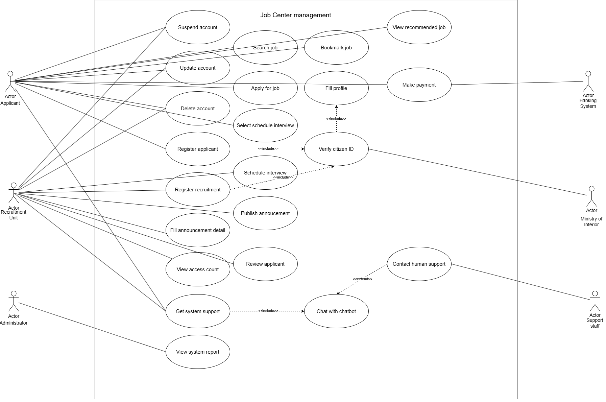
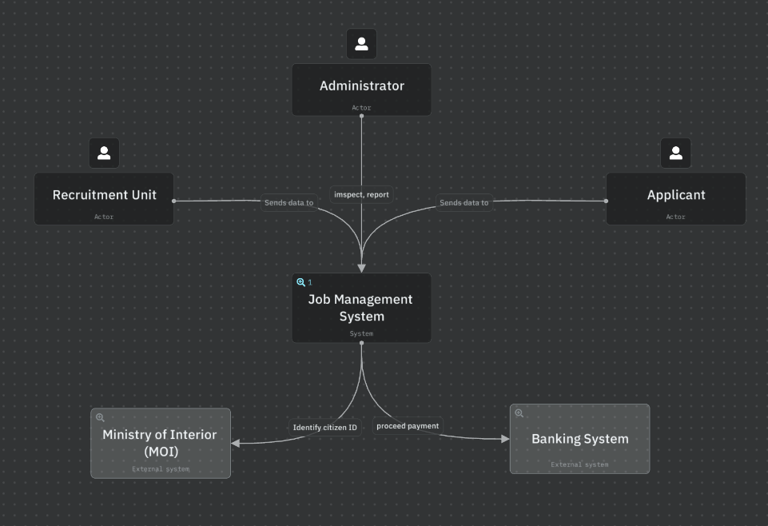
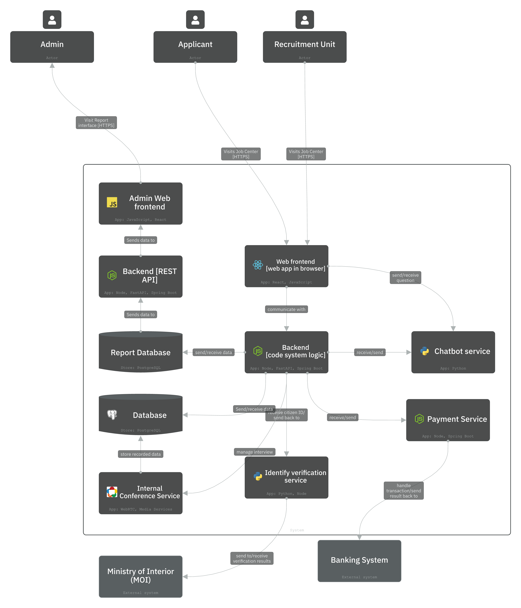
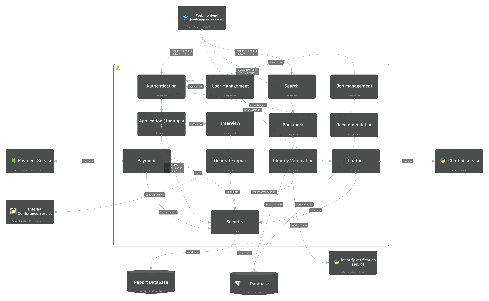
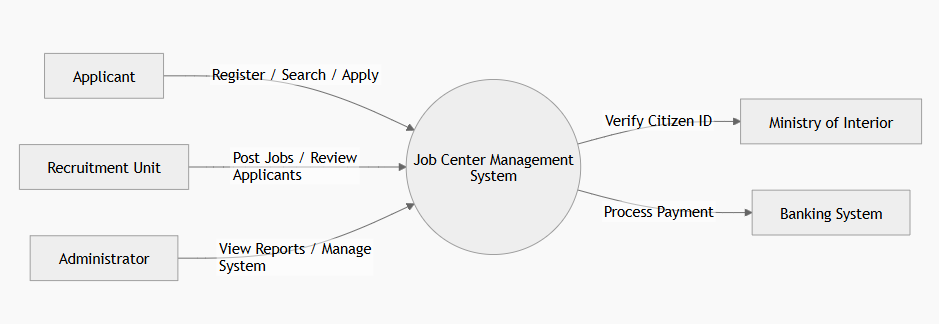
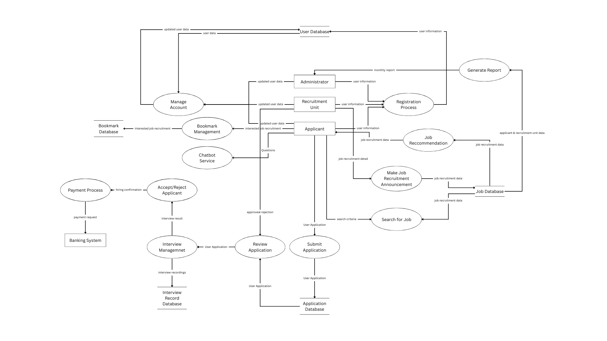
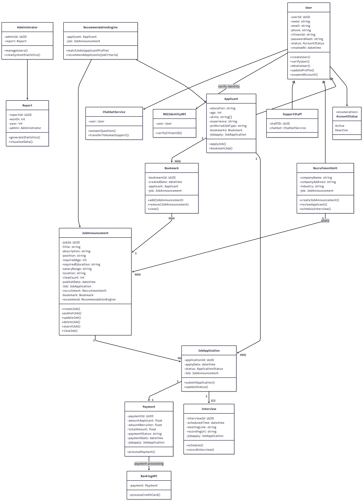

# D1: Design Models and Design Rationale

**Project:** Job Center Management System  
**Group:** Chongyai

## 1. Design Rationale

The Job Center Management System is designed to support both Functional Requirements and Non-functional Requirements, specifically handling a transaction volume of 10,000 items per day and supporting 1,000 concurrent users 24/7.

- **Component Boundaries & Responsibilities:** The architecture is divided into two main parts: the Web Frontend (Next.js) for managing UI/UX with a modern orange-yellow theme, and the Backend API (Golang) for handling core Business Logic. This separation ensures system scalability to handle higher loads. Internally, the Backend is modularized into components such as Authentication, Job Management, and Payment to ensure high maintainability.
- **Interactions with External Systems:** The system integrates with the MOI API for 13-digit Thai Citizen ID verification and a Banking System for processing service fees (500 THB for applicants and 5,000 THB for recruitment units). Decoupling these external integrations reduces internal complexity and enhances security.
- **How Models Relate to Requirements:** 
  - **Use Case Diagram:** Illustrates the functions accessible to each actor group (Applicant, Recruitment Unit, Admin), ensuring alignment with User Requirements.
  - **C4 Diagrams:** Provide an architectural overview from the Context level down to internal Components, demonstrating how the system is organized and partitioned.
  - **Data Flow Diagram (DFD):** Describes the flow of personal and payment data, addressing critical security requirements.
  - **Class Diagram:** Defines the fundamental data structures required for the database to support features such as application history (Application) and video interviews (Interview).

---

## 2. Use Case Diagram

This diagram shows the relationship between various user groups and the system, confirming that all core functional requirements are addressed.

---

## 3. C4 Diagrams

### 3.1 Context Diagram (Level 1)

Displays the scope of the system and its connections to users and external systems.

### 3.2 Container Diagram (Level 2)

Illustrates the internal technologies and containers designed to handle 1,000 concurrent users.

### 3.3 Component Diagram (Level 3 - API Application)

Deconstructs the Backend structure to confirm a clear separation of concerns.

---

## 4. Data Flow Diagrams (DFD)

### 4.1 DFD Level 0 (Context Diagram)

### 4.2 DFD Level 1

---

## 5. Class Diagram

Defines the data model and entity relationships within the system.

